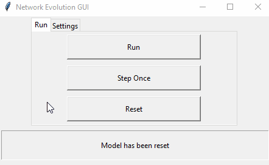
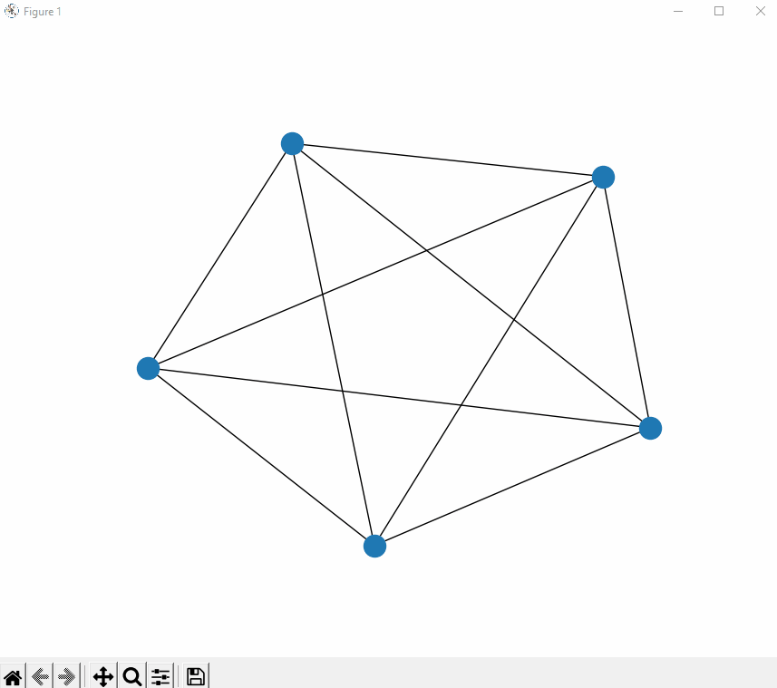
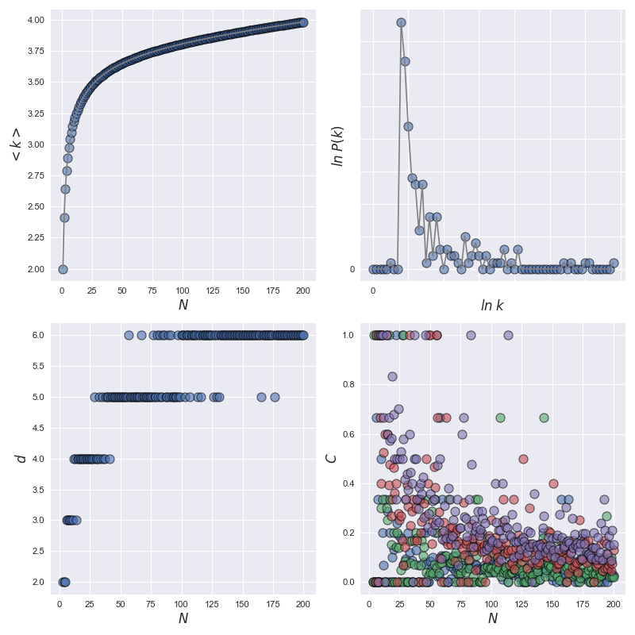

# Social network of scientific collaborations: an evolution model

## Introduction
The co-authorship network of scientists represents a prototype of complex evolving networks.
I propose a simple model that captures the network’s time evolution and a numerical simulation to uncover the behavior of
quantities that could not be predicted analytically. The combined numerical and analytical results
underline the important role internal links play in determining the observed scaling behavior and
network topology. The results and methodologies developed in the context of the co-authorship
network could be useful for a systematic study of other complex evolving networks as well,
such as the world wide web, Internet, or other social networks.

## Network model
In order to build the model, we denote by ***k<sub>i</sub>(t)*** the number of links node ***i*** has at time ***t***; by ***T(t)*** and ***N(t)*** the
total number of links and total number of nodes at time ***t***, respectively.
In addition, we assume that all nodes present in the system are active, i.e., they can author
further papers. We consider also that new researchers join the field at a constant rate, leading to


The average number of links per node in the system at time t is thus given by

=\frac{T(t)}{N(t)}" title="https://latex.codecogs.com/svg.image?\large \left<k\right>=\frac{T(t)}{N(t)}" />

Now, we define the rules that govern our evolving network model, capturing the basic mechanism governing the evolution of the co-authorship
network:
1. Nodes join the network at a constant rate.
2. Incoming nodes link to the already present nodes following **preferential attachment**.
3. Nodes already present in the network form new internal links following preferential attachment.
4. We neglect the aging of nodes, and assume that all nodes and links present in the system are active, able to initiate and receive new links.

In the model, we assume that the number of authors on a paper, ***m***, is constant. In
reality ***m*** is a stochastic variable, as the number of authors varies from paper to paper: making ***m*** a stochastic variable is not expected to change the scaling behavior.

Taking into account that new links join the system with a constant rate, ***β***, the continuum equation for the evolution of the number of links node i has can be written as:


This will be the **Master Equation**.

A quantity of major interest is the degree distribution, ***P(k)***. The nodes join the
system randomly at a constant rate, which implies that the ti values are uniformly
distributed in time between ***0*** and ***t***. The distribution function for the ti in the ***[0; t]***
interval is simply


***P(k)*** can be obtained after determining the ***t<sub>i</sub>(k<sub>i</sub>)*** dependence. This will be done using a numerical method
offered by the ```networkx``` library.

In this project we will simulate the social complex network with preferential attachment using a numerical approach alongside an analytical one.


## Structure of the project
This project consists of two parts:
1. A graphic user interface ([GUI](GUI.py)), that is an interactive tool through which the simulation
can be performed (continuously or gradually) and contextually displayed.
It has two windows, one where the graph is represented dynamically, one where the user can run the simulation.
2. A program ([model](model.py)) that numerically simulates the network dynamics following the analytical 
framework described above and plots the results.

The user can choose whether to start the [simulation](simulation.py) using the GUI or the [model](model.py) first.
Before this, the user has to set the configuration parameters of the network, indicating them in the [configuration](configuration.txt) file,
or eventually write a new one, using the syntax of configuration; if the user wants to do so, he has to be careful
to include as values of ***N*** (the number of total nodes to be reached during the simulation),
***b*** (the number of new links that an incoming node creates), ***s*** (the number of steps for growing the network),
***m*** (the number of edges per new node), ***m<sub>0</sub>*** (the number of nodes in initial condition) and ***β*** (the joining rate), **only natural numbers**.
We denote by ***a*** the number of newly created internal links per node in unit time: in this case you have to enter a value between ***0*** and ***1***.

### The graphic user interface
This very simple dinamic and interactive GUI is realized using the Python 3.9 inbuilt [tkinter](https://docs.python.org/3/library/tkinter.html) package.
```tkinter``` package (“Tk interface”) is the standard Python interface of the Tk GUI toolkit.
These are the steps in order to start the simulation using the GUI:
1. First, the user has to launch the file [simulation](simulation.py) which imports its
parameters from configuration using [ConfigParser](https://docs.python.org/3/library/configparser.html) library;
there could be different types of configurations for the model, depending on the number
of total nodes to be reached during the simulation and the number of new links that an incoming
node creates and the joining rate, so the user has to specify the configuration he wants as
it is described in the previous section. In order to start, when launching the simulation or the model file, the user has to execute it from the command
line with the syntax "**python simulation.py name_of_the_configuration**" (in our case, configuration.txt).
2. When this is done, the user will see two windows open, one for dynamic visualization of the network, the other for managing it.
In the latter there are two frames: "run" and "settings." By clicking on the second one,
it is possible to vary the number of time steps to be executed before updating the network ("step size"),
as well as the time to update the image displayed in the other window ("step visualization delay in ms").
That parameter is meant to avoid problems of slowing down or crashing the application that occur at when N has a very high value.  

3. With these parameters set, the simulation can be started continuously by pressing the "run" button in the other frame.
In case you want to analyze one time step at a time, simply click in "step once." Having conducted the analysis it is possible,
finally, to reset and repeat the operations ("reset button").  



### Model simulation
To start the simulation of the model, simply:
1. Like in GUI step 1, choose the simulation parameters and edit them in configuration.txt.
2. Even in this case launch the simulation file (that imports its parameters from the configuration)
with the command line, using same syntax "**python simulation.py configuration_name**" run the code.
3. At the end of the process the results will be plotted. A window will open with four representative subplots:
    * the **average connectivity**, **diameter** and **cluster coefficient** as a function of the population of nodes in the graph;
    * the **probability distribution of connectivity** on a logarithmic scale.

To show you some results, this is how the simulation of a given configuration looks like




### Description of the files

This is how I structured the project:
* In the [functions](functions.py) file I built the model analytical functions that calculate:
  * the evolution of the links that node i has at time step ***t***, which returns an ordered list of values
  representing the number of links that a node ***i*** has at each time step until ***t***. Its size will be ***t***;
  * the average number of links per node of the graph (network representation) at ***t*** time steps that return a list containing all
  the value for each time step until ***t***.
* In the [testing](testing.py) file, I tested both analytic functions in the model to make sure they all work correctly,
using hypothesis tests.
* The [configuration](configuration.txt) file contains all the parameter definitions used in the simulation and model files.
It is a .txt file that is imported to start the two scripts. In detail, it contains:
  * ***a*** (default = 0.001) that is the number of newly created internal links per node in unit time;
  * ***β*** (default = 1) which is the joining rate;
  * ***N*** (default = 200) that is the number of total nodes to be reached during the simulation;
  * ***b*** (default = 2) that is the number of new links that an incoming node creates;
  * ***m<sub>0</sub>*** (default = 5) that is the number of nodes at initial condition;
  * ***m*** (default = 1) which is the number of edges created per new node;
  * ***s*** (default = 10) that is the number of steps for growing the network.
*